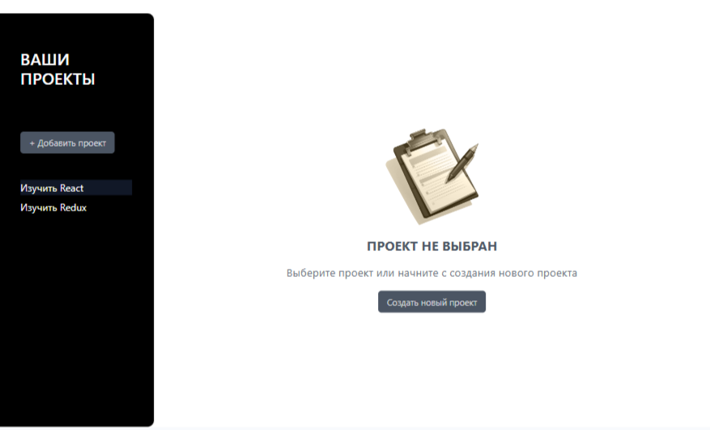
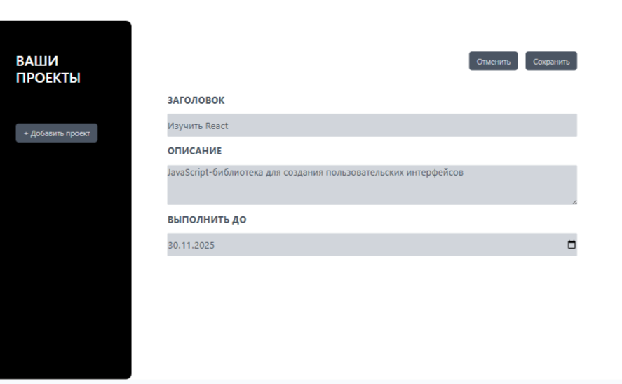
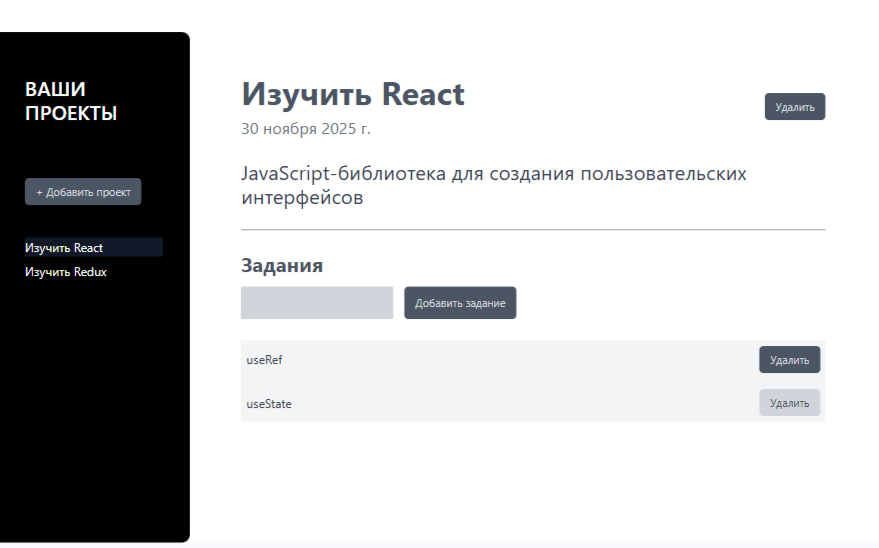

# Планировщик проектов (React)

Планировщик проектов, разработанный с использованием React и инструмента сборки Vite. Приложение демонстрирует базовые принципы работы с состоянием компонентов и обработкой событий в React. Для стилизации приложения был использован Tailwind.





## Стек

     

## Функциональность

- Добавление и удаление проектов
- Простая валидация формы добавления проекта, появление модального окна с ошибкой, если валидация не прошла
- Просмотр списка всех проектов, переключение между проектами
- Возможность выбирать конкретный проект, выделение активного проекта цветом на панели сайдбара
- Возможность добавлять и удалять задачи внутри определенного проекта

## Установка и запуск

Для установки и запуска проекта необходимо выполнить команды

```
npm install
npm run dev
```

или

```
yarn
yarn dev
```
